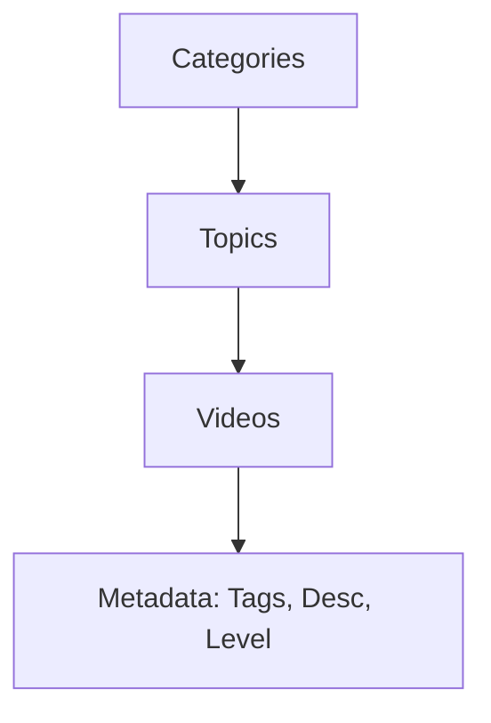

# 🚨 SiagaBencana: Platform Edukasi Terpadu & Pemulihan Pasca Bencana

<p align="center">
  
  
  
  
</p>

> **"Tanggap Bencana. Pulihkan Kehidupan."** > Sebuah sistem manajemen konten edukasi (LMS) berbasis video yang dirancang untuk mempercepat literasi mitigasi dan pemulihan ekonomi di wilayah terdampak bencana.

---

## 📑 Daftar Isi
1. [Visi & Misi](#-visi--misi)
2. [Pilar Utama (The Three Zones)](#-pilar-utama-sistem)
3. [Fitur Unggulan](#-fitur-unggulan)
4. [Arsitektur Sistem](#-arsitektur-sistem)
5. [Panduan Instalasi](#-instalasi-lokal-development)
6. [Kredensial Default](#-kredensial-akses)
7. [Roadmap Pengembangan](#-roadmap)

---

## 🎯 Visi & Misi

### 👁️ Visi
Menjadi pusat rujukan digital nasional untuk edukasi mitigasi, respons medis darurat, dan pemulihan ekonomi pasca-bencana yang ringan, cepat, dan mudah diakses bahkan dalam kondisi keterbatasan jaringan.

### 🚀 Misi
- **Literasi Sejak Dini:** Mengemas edukasi bencana tanpa trauma untuk anak-anak.
- **Resiliensi Ekonomi:** Membimbing pelaku UMKM untuk bangkit lebih cepat melalui manajemen keuangan darurat.
- **Standarisasi Medis:** Menyediakan SOP digital yang ringkas bagi relawan dan tenaga medis di lapangan.

---

## 🧩 Pilar Utama Sistem

| 🟦 Zona Ceria (Anak) | 🟩 Zona Bangkit (UMKM) | 🟥 Zona Siaga (Medis) |
| :--- | :--- | :--- |
| Fokus pada video animasi mitigasi. | Strategi pemulihan modal & usaha. | SOP P3K & Tanggap Darurat. |
| **UI:** Warna cerah & Ikon besar. | **UI:** Professional & Informatif. | **UI:** High Contrast & To-the-point. |
| Mengurangi trauma pasca-bencana. | Akses informasi bantuan modal. | Prosedur penanganan korban. |

---

## 🚀 Fitur Unggulan

### 🎥 YouTube-Style Learning Studio
Sistem pengaplotan materi yang mengadopsi antarmuka YouTube untuk kemudahan penggunaan:
- **Metadata Lengkap:** Judul, Deskripsi Panjang, Tags, dan Level (Pemula - Lanjut).
- **YouTube Integration:** Menggunakan ID Video YouTube untuk menghemat *bandwidth* server dan penyimpanan.
- **Auto-Thumbnail:** Sistem secara otomatis menarik gambar mini dari server YouTube berdasarkan ID.

### 🧭 Multi-Persona Experience
Platform mendeteksi profil pengguna untuk menyajikan konten yang paling relevan sejak halaman utama:
1. **User Discovery:** Memilih minat (Anak/UMKM/Medis) saat pertama kali masuk.
2. **Dynamic Dashboard:** Tampilan yang berubah sesuai dengan kategori yang dipilih.

### ⚡ Performance Optimized
- **Server-Side Rendering:** Menggunakan Laravel Blade untuk kecepatan muat awal.
- **Tailwind JIT:** Memastikan file CSS sangat kecil dan optimal.
- **Database Indexing:** Optimasi pencarian pada judul dan tags video.

---

## 🏗️ Arsitektur Sistem

### 🧱 Tech Stack
- **Framework:** Laravel 11/12 (Modern Structure)
- **Frontend:** Blade Templating + Tailwind CSS
- **Authentication:** Laravel Breeze (Customized)
- **State Management:** Alpine.js
- **Database:** MariaDB / MySQL 8.x

### 🗂️ Skema Data
Sistem menggunakan hierarki 3 level yang ketat untuk menjaga integritas data:


---

## 🛠️ Instalasi Lokal (Development)

### 1. Persiapan Environment

Pastikan Anda memiliki:

* PHP >= 8.2
* Composer
* Node.js & NPM
* MySQL/MariaDB

### 2. Langkah Instalasi

```bash
# Clone repository
git clone [https://github.com/username/siagabencana.git](https://github.com/username/siagabencana.git)
cd siagabencana

# Install dependencies
composer install
npm install && npm run build

# Setup .env
cp .env.example .env
php artisan key:generate

```

### 3. Database & Storage

```bash
# Buat database 'edukasi_bencana' di MySQL Anda
# Jalankan migrasi dan data awal
php artisan migrate:fresh --seed

# Hubungkan storage untuk thumbnail topik
php artisan storage:link

```

---

## 🔐 Kredensial Akses

| Akun | Email | Password | Role |
| --- | --- | --- | --- |
| **Super Admin** | `admin@gmail.com` | `password` | Administrator |
| **User Demo** | `user@gmail.com` | `password` | Reguler User |

---

## 🗺️ Roadmap

* [x] **Phase 1:** Core Arch & Database modularity.
* [x] **Phase 2:** Admin Studio (YouTube-style uploader).
* [ ] **Phase 3:** User Interest Picker (3 Zones).
* [ ] **Phase 4:** Search Engine & Real-time Filtering.
* [ ] **Phase 5:** PWA & Offline Materi Support.

---

## ⚖️ Lisensi & Kontribusi

Proyek ini dilisensikan di bawah **MIT License**. Kami sangat terbuka untuk kontribusi terutama pada konten edukasi dan optimasi performa di area minim sinyal.

**Technology for Humanity.** Dibuat dengan ❤️ untuk Indonesia yang lebih tangguh.

